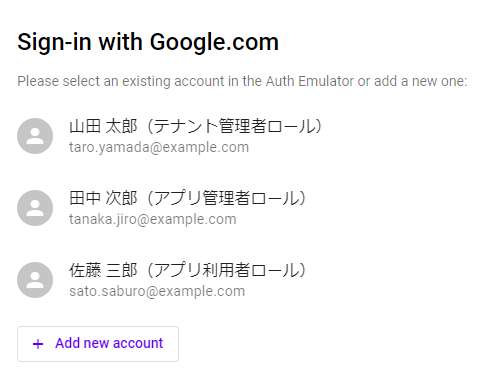

# 設計から学ぶ Firebase 実践ガイド サンプルアプリ anpi!

## 本書籍について

「設計から学ぶ Firebase 実践ガイド」

- 著者 : 押野泰平、長谷川健史、岡田菜摘
- URL : https://nextpublishing.jp/book/16459.html
- NextPublishing 2023 年

## セットアップ

※以下はサンプルアプリをローカルで動作させるための内容です

### 前提条件

本サンプルアプリの動作には、以下のソフトウェアが必要になります。
- Node.js (v16)
- yarn
- firebase-tools

### パッケージのインストール

```bash
# フロントエンド画面のためのパッケージインストール
# まずプロジェクトフォルダ直下で以下を実行してください
yarn install

# Cloud Functionsのためのパッケージインストール
# 次にfunctionsフォルダ配下に移動し、再度yarn installを実行してください
cd functions
yarn install

# 正常に終了したらプロジェクト直下に戻っておきましょう
cd ..
```

## サンプルアプリの起動

下記の 1 ～ 3 のコマンドを順次実行してください。<br/>
いずれもサンプルアプリ起動中に必要なため、ターミナルを 3 つ用意することをお勧めします。

### 1. Cloud Functions ソースの更新監視の起動

```bash
yarn watch:functions
```

### 2. Firebase Local Emulator Suite の起動

```bash
yarn emulators
```

### 3. フロントエンド画面の起動

```bash
yarn quasar dev
```

サンプルアプリを停止する場合は、各ターミナル内で Ctrl+c を押下してください。

## サンプルアプリの操作

本リポジトリ内にはサンプルデータが含まれています。<br/>
そちらを利用する場合は、ログイン時に「Google アカウントでログイン」を選択してください。

以下の画像のユーザーがサンプルとして登録されていますので、任意のユーザーで操作頂いて構いません。



## 【参考】サンプルアプリのビルド

上記手順は Quasar の提供する開発サーバー上で動作させる際のものになります。<br/>
Firebase Hosting やその他の静的ウェブサイトホスティング基盤にデプロイしたい場合などは、以下のコマンドでビルドし、 dist フォルダ配下の成果物を利用してください。

```bash
yarn quasar build
```

## 謝辞

アイコン素材の一部は以下からダウンロードさせていただきました。

https://www.silhouette-illust.com/
